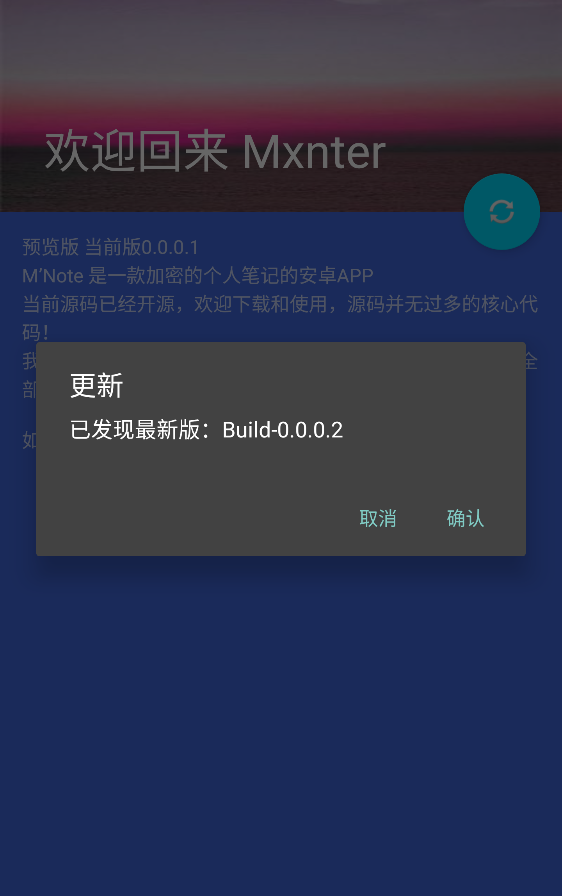
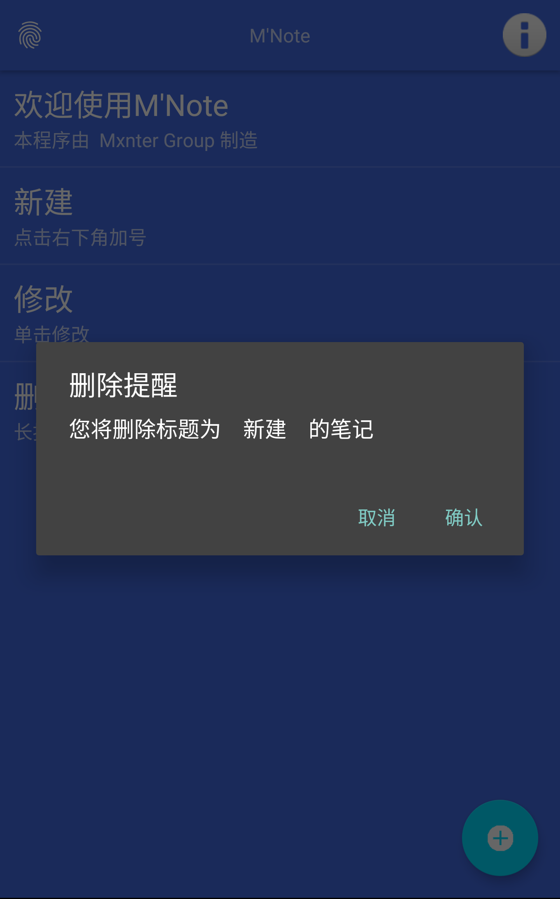

# MNote-Build
M’Note 是一款加密的个人笔记的安卓APP 预览阶段
==============

## 目录
* [一丶简述](#简述)
* [二丶效果图](#效果图)
* [三丶更新日志](#更新日志)
* [四丶其他相关](#其他相关)

# 一丶简述
>M’Note 是一款加密的个人笔记的安卓APP 预览阶段。
>
>由于样式问题现在仅支持 Android 6.0 以上使用，6.0以下版本将会出现登陆界面闪退情况，现已决定仅兼容6.0以上版本。
>
>项目由 [Loswkl](https://github.com/loswkl) 的 [L'Note](https://github.com/loswkl/LNote-Preview) 进一步开发而来。
>
>[GitHub](https://github.com/mxnter/MNote-Build)
>
>当前版项目下载：[MNote](https://mxnter.github.io/information/MNote/app/MNote.apk)
>
当前软件是由[L’Note](https://github.com/loswkl/LNote-Preview) 继续开发的下一版本

# 二丶效果图

# 三丶更新日志

## MNote-Build 0.0.0.1 - 01

1.构建 软件主体构建完成

## MNote-Build 0.0.0.1 - 02

1.修复 保存后不回到Note页面

## MNote-Build 0.0.0.1 - 03

1.新增 个人信息页面

2.更新 个人信息界面可以修改 用户名 手机号

# 四丶其他相关

## 欢迎下载使用，如需反馈请联系 github@mter.xyz
